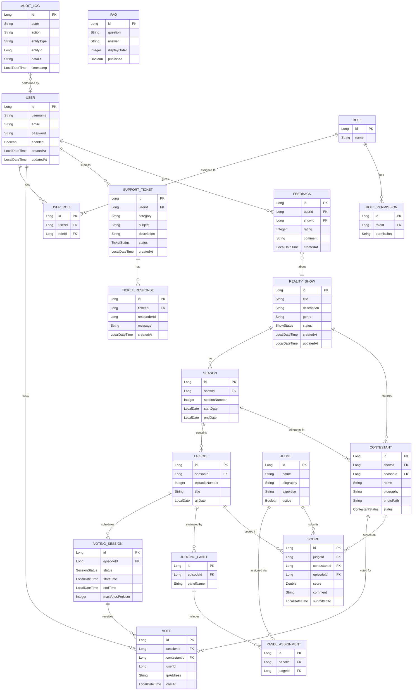
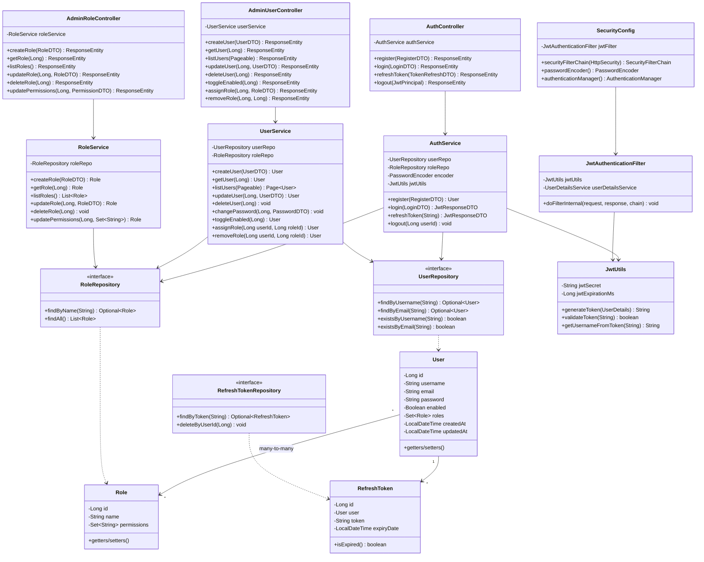
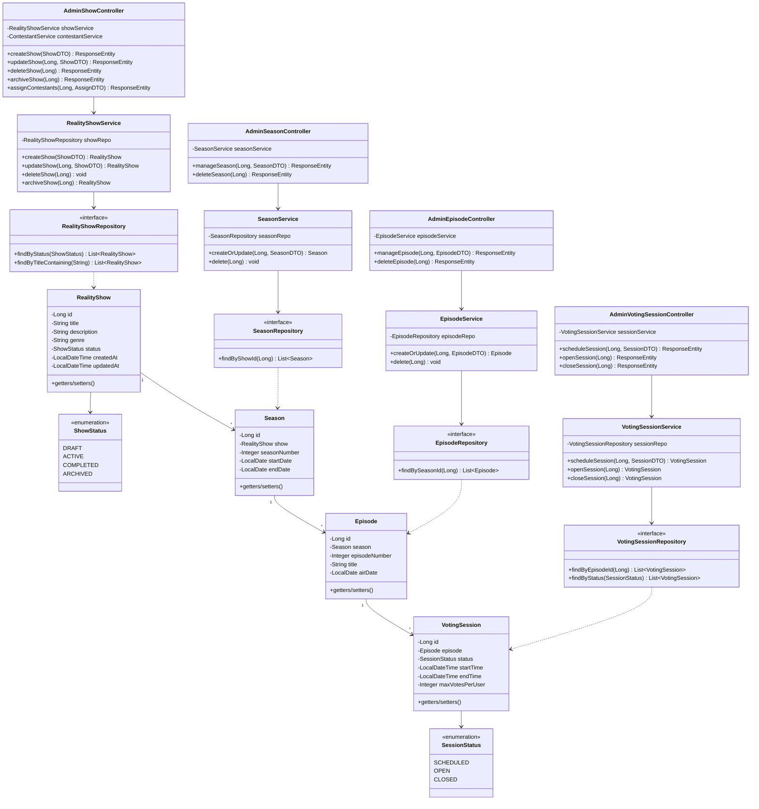
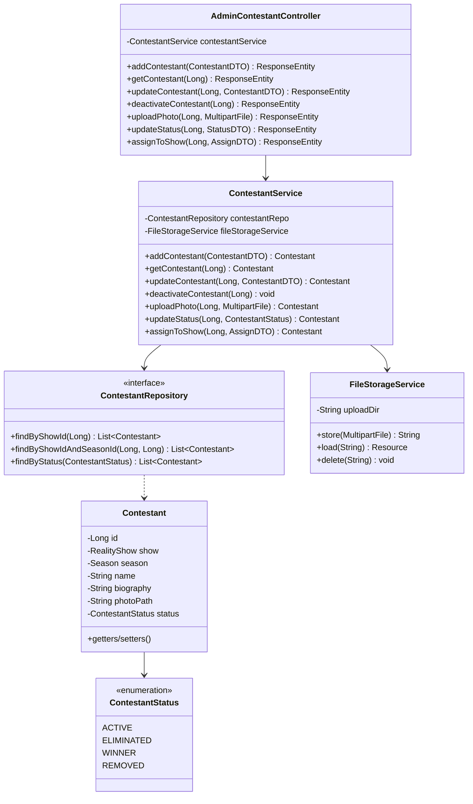
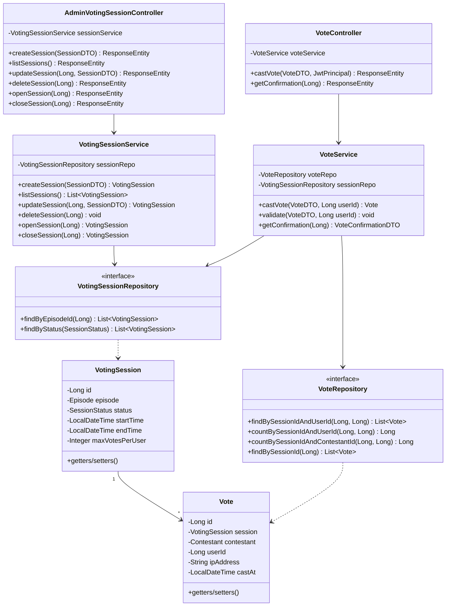
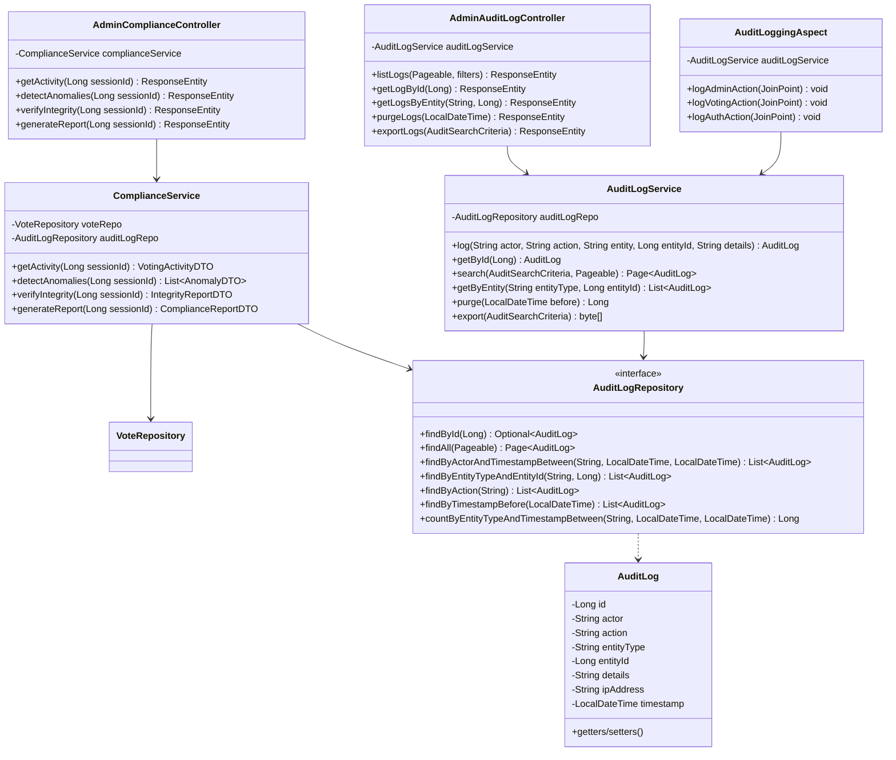
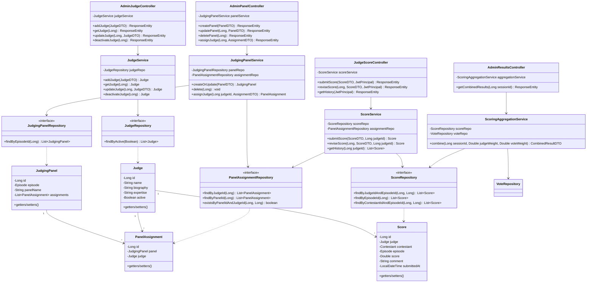
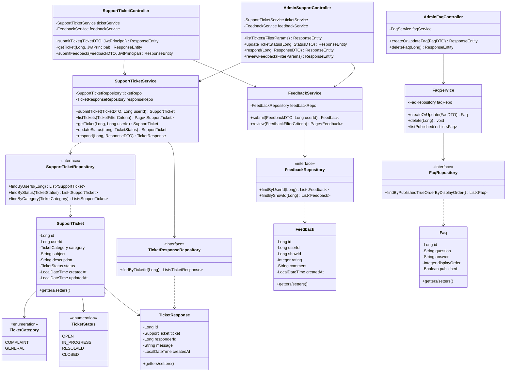
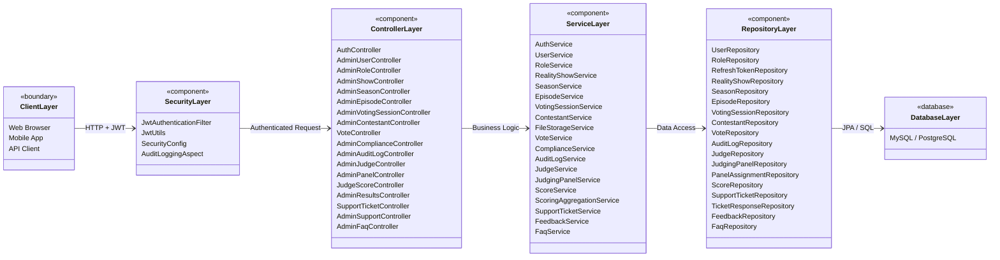

# Six-Module Reality Show Voting System — Implementation Plan

A full-stack Spring Boot REST API implementing six core modules for a web-based voting system for reality shows: Reality Show Management, Contestant Management, Voting & Voting Session Management, Voting Compliance & Security, Judge & Panel Management, and Customer Support & Complaint Management.

---

## UML Class Diagrams

### Complete Entity Relationship Diagram



---

### Module 6.0 — Security & Authentication (Class Diagram)



---

### Module 6.1 — Reality Show Management (Class Diagram)



---

### Module 6.2 — Contestant Management (Class Diagram)



---

### Module 6.3 — Voting & Voting Session Management (Class Diagram)



---

### Module 6.4 — Voting Compliance & Security (Class Diagram)

> [!NOTE]
> The `Role` and `User` entities are **defined in Module 6.0** (Security & Authentication). This module **reuses** them and adds compliance-specific operations. The `AdminRoleController` from Module 6.0 already provides full Role CRUD — this module's `AdminComplianceController` focuses on voting-specific monitoring and reporting.



---

### Module 6.5 — Judge & Panel Management (Class Diagram)



---

### Module 6.6 — Customer Support & Complaint Management (Class Diagram)



---

### System-Wide Architecture Overview



---

## User Review Required

> [!IMPORTANT]
> **Database Choice**: The plan assumes **PostgreSQL** as the primary database. If you prefer MySQL or another RDBMS, please confirm.

> [!IMPORTANT]
> **Module 6.0 (NEW)**: A full **Security & Authentication module** has been added with User entity, JWT login/register, refresh tokens, and full User + Role CRUD. This was not in the original six-module spec but is required as the foundation for all JWT-based security referenced throughout the system.

> [!WARNING]
> **File Storage for Photos**: Module 6.2 requires photo upload/storage. The plan uses local filesystem storage via `FileStorageService`. For production, consider cloud storage (S3, GCS). Please confirm if local storage is acceptable for the initial implementation.

## Open Questions

1. **Java version**: Should we target Java 17 or Java 21?
2. **Database**: PostgreSQL or MySQL?
3. **Scoring formula**: Module 6.5 references a "configurable weighting formula" for combining judge scores with audience votes. What is the default weight split (e.g., 50/50, 70/30)?
4. **Vote uniqueness constraint**: Is the duplicate-vote check per session (one vote per user per session) or per session per contestant (user can vote for different contestants in the same session)?
5. **Pagination**: Should list endpoints support pagination by default (Spring `Pageable`)?

---

## Proposed Changes

### Project Initialization

#### [NEW] Spring Boot Project

Initialize a Spring Boot 3.x project with:
- **Group**: `com.antivote`
- **Artifact**: `anti-vote`
- **Dependencies**: Spring Web, Spring Data JPA, Spring Security, Spring Validation, Lombok, PostgreSQL Driver, Spring AOP, jjwt (io.jsonwebtoken)

---

### Package Structure

```
com.antivote
├── config/
│   ├── SecurityConfig.java
│   ├── JwtAuthenticationFilter.java
│   └── JwtUtils.java
├── entity/
│   ├── User.java
│   ├── Role.java
│   ├── RefreshToken.java
│   ├── RealityShow.java
│   ├── Season.java
│   ├── Episode.java
│   ├── VotingSession.java
│   ├── Contestant.java
│   ├── Vote.java
│   ├── Judge.java
│   ├── JudgingPanel.java
│   ├── PanelAssignment.java
│   ├── Score.java
│   ├── AuditLog.java
│   ├── SupportTicket.java
│   ├── TicketResponse.java
│   ├── Feedback.java
│   └── Faq.java
├── enums/
│   ├── ShowStatus.java
│   ├── SessionStatus.java
│   ├── ContestantStatus.java
│   ├── TicketCategory.java
│   └── TicketStatus.java
├── dto/
│   ├── auth/
│   │   ├── RegisterDTO.java
│   │   ├── LoginDTO.java
│   │   ├── JwtResponseDTO.java
│   │   ├── TokenRefreshDTO.java
│   │   ├── UserDTO.java
│   │   ├── RoleDTO.java
│   │   └── PasswordDTO.java
│   ├── (request/response DTOs per module)
├── repository/
│   ├── UserRepository.java
│   ├── RoleRepository.java
│   ├── RefreshTokenRepository.java
│   ├── RealityShowRepository.java
│   ├── SeasonRepository.java
│   ├── EpisodeRepository.java
│   ├── VotingSessionRepository.java
│   ├── ContestantRepository.java
│   ├── VoteRepository.java
│   ├── JudgeRepository.java
│   ├── JudgingPanelRepository.java
│   ├── PanelAssignmentRepository.java
│   ├── ScoreRepository.java
│   ├── AuditLogRepository.java
│   ├── SupportTicketRepository.java
│   ├── TicketResponseRepository.java
│   ├── FeedbackRepository.java
│   └── FaqRepository.java
├── service/
│   ├── AuthService.java
│   ├── UserService.java
│   ├── RoleService.java
│   ├── RealityShowService.java
│   ├── SeasonService.java
│   ├── EpisodeService.java
│   ├── VotingSessionService.java
│   ├── ContestantService.java
│   ├── FileStorageService.java
│   ├── VoteService.java
│   ├── ComplianceService.java
│   ├── AuditLogService.java
│   ├── JudgeService.java
│   ├── JudgingPanelService.java
│   ├── ScoreService.java
│   ├── ScoringAggregationService.java
│   ├── SupportTicketService.java
│   ├── FeedbackService.java
│   ├── FaqService.java
│   └── ReportService.java
├── controller/
│   ├── auth/
│   │   └── AuthController.java
│   ├── admin/
│   │   ├── AdminUserController.java
│   │   ├── AdminRoleController.java
│   │   ├── AdminShowController.java
│   │   ├── AdminSeasonController.java
│   │   ├── AdminEpisodeController.java
│   │   ├── AdminVotingSessionController.java
│   │   ├── AdminContestantController.java
│   │   ├── AdminComplianceController.java
│   │   ├── AdminAuditLogController.java
│   │   ├── AdminJudgeController.java
│   │   ├── AdminPanelController.java
│   │   ├── AdminResultsController.java
│   │   ├── AdminReportController.java
│   │   ├── AdminSupportController.java
│   │   └── AdminFaqController.java
│   └── viewer/
│       ├── VoteController.java
│       ├── JudgeScoreController.java
│       └── SupportTicketController.java
├── aspect/
│   └── AuditLoggingAspect.java
└── exception/
    ├── GlobalExceptionHandler.java
    ├── ResourceNotFoundException.java
    ├── InvalidStateException.java
    ├── DuplicateVoteException.java
    └── AuthenticationException.java
```

---

### Module 6.0 — Security & Authentication (NEW)

This is the **foundational module** that all other modules depend on for JWT authentication and role-based access.

#### [NEW] `User.java`
JPA entity mapped to `users` table. Fields: `id`, `username`, `email`, `password` (BCrypt hashed), `enabled`, `createdAt`, `updatedAt`. Many-to-many relationship with `Role` via `user_roles` join table.

#### [NEW] `Role.java`
JPA entity mapped to `roles` table. Fields: `id`, `name`, `permissions` (element collection). Predefined roles: `ADMIN`, `REALITY_SHOW_MANAGER`, `CONTESTANT_STAFF`, `SECURITY_OFFICER`, `JUDGE`, `SUPPORT_STAFF`, `VIEWER`.

#### [NEW] `RefreshToken.java`
JPA entity for JWT refresh token rotation. Fields: `id`, `user` (FK), `token`, `expiryDate`.

#### [NEW] `UserRepository.java`, `RoleRepository.java`, `RefreshTokenRepository.java`
Spring Data JPA interfaces with finders by username, email, token, and role name.

#### [NEW] `AuthService.java`
Registration (with duplicate username/email check), login (BCrypt verify → JWT issue), token refresh, and logout (revoke refresh token).

#### [NEW] `UserService.java`
Full User CRUD for admins: create, get, list (paginated), update, delete, toggle enabled, assign/remove roles, change password.

#### [NEW] `RoleService.java`
Full Role CRUD: create, get, list, update, delete, update permissions.

#### [NEW] `JwtUtils.java`
JWT generation, validation, and claim extraction using `io.jsonwebtoken` (jjwt).

#### [NEW] `JwtAuthenticationFilter.java`
OncePerRequestFilter that extracts JWT from `Authorization: Bearer <token>` header, validates it, and sets the SecurityContext.

#### [NEW] `SecurityConfig.java`
Spring Security configuration: stateless session, JWT filter registration, endpoint-level access rules, BCrypt password encoder, CORS config.

#### [NEW] `AuthController.java`
Public endpoints (no auth required):

| # | Endpoint | Method | Description |
|---|---|---|---|
| 1 | `POST /auth/register` | Register | Creates new user with default VIEWER role |
| 2 | `POST /auth/login` | Login | Returns JWT access token + refresh token |
| 3 | `POST /auth/refresh` | Refresh | Issues new access token using refresh token |
| 4 | `POST /auth/logout` | Logout | Revokes refresh token (requires auth) |

#### [NEW] `AdminUserController.java`
Admin-only endpoints (`ADMIN` role required):

| # | Endpoint | Method | Description |
|---|---|---|---|
| 1 | `POST /admin/users` | Create | Admin creates user with specific roles |
| 2 | `GET /admin/users` | List | Paginated user listing with filters |
| 3 | `GET /admin/users/{id}` | Read | Single user profile with roles |
| 4 | `PUT /admin/users/{id}` | Update | Edit user details (username, email) |
| 5 | `DELETE /admin/users/{id}` | Delete | Hard-delete user (blocked if has votes/tickets) |
| 6 | `PATCH /admin/users/{id}/toggle` | Toggle | Enable/disable user account |
| 7 | `POST /admin/users/{id}/roles` | Assign Role | Adds a role to the user |
| 8 | `DELETE /admin/users/{id}/roles/{roleId}` | Remove Role | Removes a role from the user |
| 9 | `PATCH /admin/users/{id}/password` | Reset Password | Admin resets a user's password |

#### [NEW] `AdminRoleController.java`
Admin-only endpoints (`ADMIN` role required):

| # | Endpoint | Method | Description |
|---|---|---|---|
| 1 | `POST /admin/roles` | Create | Creates a new role |
| 2 | `GET /admin/roles` | List | Lists all roles |
| 3 | `GET /admin/roles/{id}` | Read | Role details with permissions |
| 4 | `PUT /admin/roles/{id}` | Update | Edit role name |
| 5 | `DELETE /admin/roles/{id}` | Delete | Deletes role (blocked if assigned to users) |
| 6 | `PUT /admin/roles/{id}/permissions` | Update Permissions | Sets the permission set for a role |

**Total Module 6.0 Endpoints: 19**

---

### Module 6.1 — Reality Show Management

#### [NEW] `RealityShow.java`, `Season.java`, `Episode.java`, `VotingSession.java`
JPA entities mapped to `reality_shows`, `seasons`, `episodes`, `voting_sessions` tables.

#### [NEW] `RealityShowRepository.java`, `SeasonRepository.java`, `EpisodeRepository.java`, `VotingSessionRepository.java`
Spring Data JPA interfaces with custom finders.

#### [NEW] `RealityShowService.java`, `SeasonService.java`, `EpisodeService.java`, `VotingSessionService.java`
Business logic including status transitions (DRAFT→ACTIVE→COMPLETED→ARCHIVED), validation of date ranges, cascade deletion guards.

#### [NEW] `AdminShowController.java`, `AdminSeasonController.java`, `AdminEpisodeController.java`, `AdminVotingSessionController.java`
REST controllers secured with `@PreAuthorize("hasRole('ADMIN') or hasRole('REALITY_SHOW_MANAGER')")`.

**Endpoints**: 8 endpoints as specified (POST/PUT/DELETE/PATCH for shows, seasons, episodes, voting sessions).

---

### Module 6.2 — Contestant Management

#### [NEW] `Contestant.java`
Entity with FK to `reality_shows` and `seasons`, status enum, photo path.

#### [NEW] `ContestantRepository.java`
Finders by show, season, and status.

#### [NEW] `ContestantService.java`, `FileStorageService.java`
Contestant CRUD + soft-delete logic. File storage for photo uploads with content-type and size validation.

#### [NEW] `AdminContestantController.java`
7 endpoints for contestant lifecycle including photo upload via `@RequestPart`.

---

### Module 6.3 — Voting & Voting Session Management

#### [NEW] `Vote.java`
Entity with unique constraint on `(session_id, user_id)` to prevent duplicate votes at DB level.

#### [NEW] `VoteRepository.java`
Custom queries for vote counts, duplicate detection, and per-session aggregation.

#### [NEW] `VoteService.java`
Validation logic: session must be OPEN, user hasn't exceeded `maxVotesPerUser`, contestant belongs to the session's episode. User ID derived from JWT, not client input.

#### [NEW] `VoteController.java`
Viewer-facing endpoints for casting votes and retrieving confirmation receipts.

**Endpoints**: 9 sub-functions (6 admin session management + 3 viewer vote operations).

---

### Module 6.4 — Voting Compliance & Security (EXPANDED)

> [!NOTE]
> Role CRUD is handled by `AdminRoleController` in Module 6.0. This module focuses on **compliance monitoring, audit trail, and voting integrity** — the security-officer-facing operations.

#### [NEW] `AuditLog.java`
Entity for immutable audit trail. Fields: `id`, `actor`, `action`, `entityType`, `entityId`, `details`, `ipAddress`, `timestamp`.

#### [NEW] `AuditLogRepository.java`
Extended Spring Data JPA interface with finders by actor, entity, action, timestamp range, plus count queries for reporting.

#### [NEW] `ComplianceService.java`
Anomaly detection (IP-based spike analysis), integrity verification (count reconciliation), compliance report generation.

#### [NEW] `AuditLogService.java`
Full audit log management: auto-log via aspect, search/filter, get by ID, get by entity, purge old entries, export.

#### [NEW] `AuditLoggingAspect.java`
`@Aspect` that intercepts all admin write operations, voting actions, and auth events to emit `AuditLog` entries automatically.

#### [NEW] `AdminComplianceController.java`
Compliance monitoring endpoints:

| # | Endpoint | Method | Description |
|---|---|---|---|
| 1 | `GET /admin/compliance/activity` | Read | Near-real-time voting throughput and per-contestant counts |
| 2 | `GET /admin/compliance/anomalies` | Read | Flags IP-based vote spikes and suspicious patterns |
| 3 | `GET /admin/compliance/verify/{sessionId}` | Read | Reconciles stored counts vs raw vote records |
| 4 | `GET /admin/compliance/reports/{sessionId}` | Read | Audit-ready compliance report for a session |

#### [NEW] `AdminAuditLogController.java`
Full audit log CRUD endpoints:

| # | Endpoint | Method | Description |
|---|---|---|---|
| 1 | `GET /admin/audit-logs` | List | Paginated, filterable list of all audit entries |
| 2 | `GET /admin/audit-logs/{id}` | Read | Single audit log entry by ID |
| 3 | `GET /admin/audit-logs/entity/{type}/{entityId}` | Read | All audit entries for a specific entity |
| 4 | `DELETE /admin/audit-logs/purge` | Purge | Deletes audit entries older than a given date |
| 5 | `GET /admin/audit-logs/export` | Export | Downloads filtered audit log as CSV/JSON |

**Total Module 6.4 Endpoints: 9** (4 compliance + 5 audit log)

---

### Module 6.5 — Judge & Panel Management

#### [NEW] `Judge.java`, `JudgingPanel.java`, `PanelAssignment.java`, `Score.java`
Entities modeling judges, panels, assignments, and scores.

#### [NEW] `ScoreService.java`, `ScoringAggregationService.java`
Score submission with panel-assignment authorization checks. Configurable weighted aggregation of judge scores + audience votes.

#### [NEW] `JudgeScoreController.java`
Judge-facing endpoints secured to only allow scoring within assigned panels.

**Endpoints**: 11 sub-functions across 4 controllers.

---

### Module 6.6 — Customer Support & Complaint Management

#### [NEW] `SupportTicket.java`, `TicketResponse.java`, `Feedback.java`, `Faq.java`
Entities for ticket lifecycle, staff responses, user feedback, and FAQ content.

#### [NEW] `SupportTicketService.java`, `FeedbackService.java`, `FaqService.java`
Ticket state machine (OPEN→IN_PROGRESS→RESOLVED→CLOSED), ownership checks against JWT subject.

#### [NEW] `SupportTicketController.java`, `AdminSupportController.java`, `AdminFaqController.java`
7 sub-functions with viewer self-service and admin management endpoints.

---

### Cross-Cutting Concerns

#### [NEW] `SecurityConfig.java`, `JwtAuthenticationFilter.java`
Spring Security configuration with JWT validation, role-based endpoint protection.

#### [NEW] `GlobalExceptionHandler.java`
`@ControllerAdvice` for consistent error responses (400, 403, 404, 409, 500).

#### [NEW] `application.yml`
Database connection, JWT secret, file upload limits, server port configuration.

---

## Verification Plan

### Automated Tests
- **Unit tests** for every Service class using Mockito:
  ```bash
  mvn test -pl . -Dtest="*ServiceTest"
  ```
- **Integration tests** for Repository layer with `@DataJpaTest`:
  ```bash
  mvn test -pl . -Dtest="*RepositoryTest"
  ```
- **Controller tests** with `@WebMvcTest` and MockMvc:
  ```bash
  mvn test -pl . -Dtest="*ControllerTest"
  ```
- **Full build**:
  ```bash
  mvn clean verify
  ```

### Manual Verification
- Test all 50+ endpoints via Postman/Insomnia collection
- Verify JWT authentication and role-based access control
- Test voting flow end-to-end: create show → season → episode → session → open → cast vote → confirm → close
- Verify audit log entries are created for all admin operations
- Test file upload with valid/invalid content types and sizes
